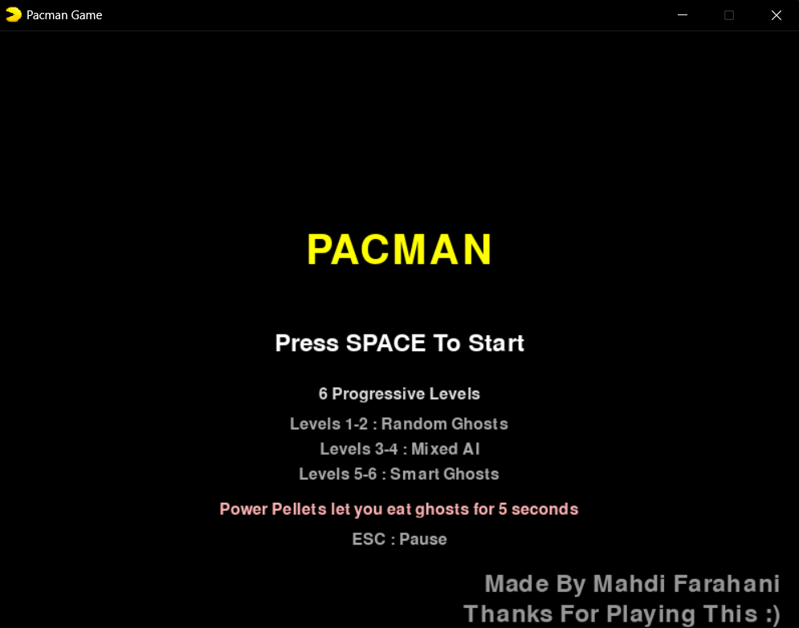
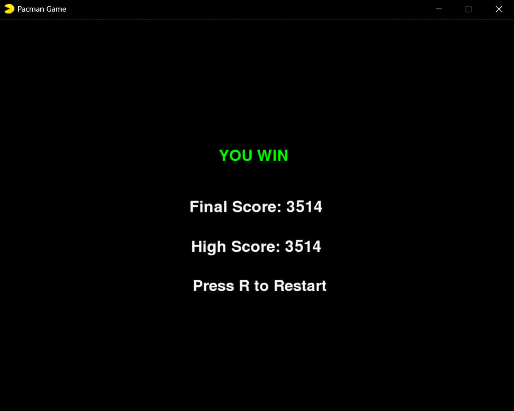

# 🟡 PacMan Game

<p align="center">
  <a href="./README_FA.md">🇮🇷 فارسی</a> •
  <strong>🇺🇸 English</strong>
</p>

<p align="center">


</p>

---

<p align="center">

</p>

## 🎮 Gameplay

Navigate through the maze, collect every dot, and avoid the ghosts.

Power Pellets temporarily turn the tables, allowing Pac-Man to eat ghosts for bonus points before the effect wears off.

As you progress through six levels, both the number of ghosts and their AI become increasingly challenging.

---

## 📖 About

**PacMan** is a modern recreation of the classic arcade game built with **Python** and **Pygame**.

In addition to recreating the original gameplay, this project introduces progressive difficulty, multiple ghost AI behaviors, power pellets, pixel-art sprites, sound effects, colorful themes, and a clean modular architecture.

The project was developed as a personal learning project focused on:

* Object-Oriented Programming (OOP)
* Game Development with Pygame
* Artificial Intelligence
* BFS Pathfinding
* Modular Software Architecture
* Resource & Asset Management

---

## ✨ Features

* 6 progressively challenging levels
* Three ghost AI systems

  * Random Movement
  * Mixed AI
  * BFS Pathfinding
* Power Pellets
* Pixel-Art Sprites
* Dynamic Color Themes
* Smooth Grid-Based Movement
* Pause Menu
* High Score Saving
* Automatic Save Folder Creation
* Standalone Windows Executable (.exe)
* Sound Effects & Background Music
* Victory & Game Over Screens

---

## 📸 Screenshots

### Main Menu



---

### Power Mode


---

### Victory Screen



---

## 🎮 Controls

| Key        | Action     |
| ---------- | ---------- |
| Arrow Keys | Move       |
| ESC        | Pause      |
| SPACE      | Start Game |
| R          | Restart    |

---

## 🛠 Technologies

* Python 3.11
* Pygame 2.6
* Breadth-First Search (BFS)
* Object-Oriented Programming
* Pixel Art
* Windows Executable Packaging (PyInstaller)

---

## 📁 Project Structure

```text
assets/
core/
game/
screens/
docs/
main.py
README.md
README_FA.md
LICENSE
```

---

## 🚀 Installation

Clone the repository:

```bash
git clone https://github.com/mahdifarahanicode/PacMan-Game.git
cd PacMan-Game
```

Install the dependency:

```bash
pip install pygame
```

Run the game:

```bash
python main.py
```

Or simply download the latest standalone executable from the **Releases** section.

---

## 💾 Save Data

The game automatically creates its save folder on the first launch.

On Windows, game data is stored in:

```text
%LOCALAPPDATA%/PacMan/
```

This folder contains:

* High Score
* Crash Logs

No additional setup is required.

---

## 👨‍💻 Author

**Mahdi Farahani**

Computer Engineering Student

Built with **Python** and **Pygame** as a personal game development project.

If you enjoyed this project, consider leaving a ⭐ on the repository.