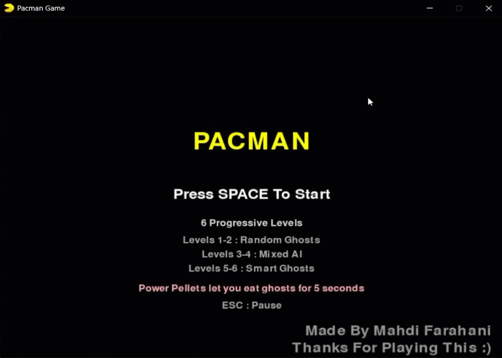
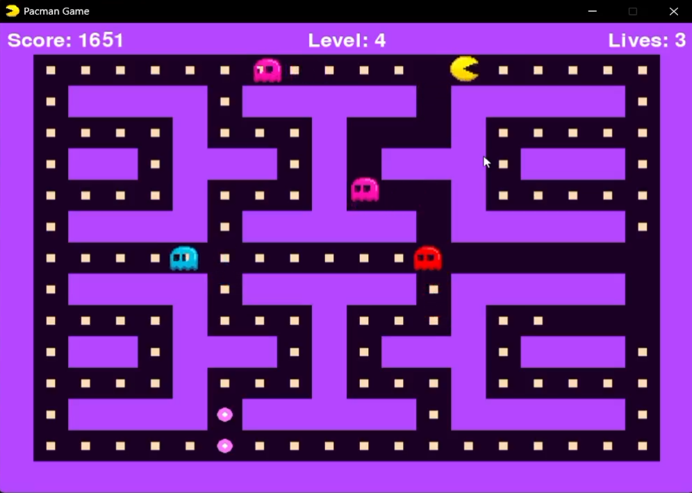
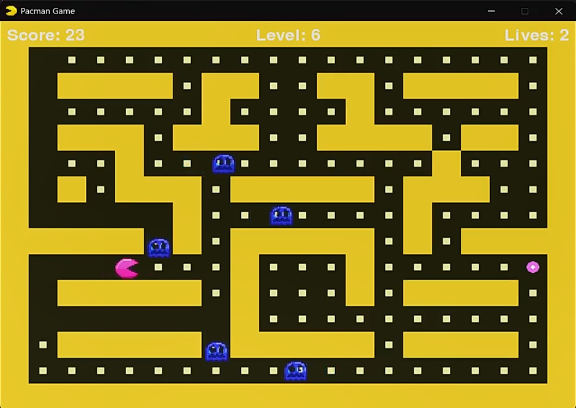

# 🟡 Pac-Man Game

<p align="center">
  <a href="./README_FA.md">🇮🇷 فارسی</a> •
  <strong>🇺🇸 English</strong>
</p>

<p align="center">


</p>

---

<p align="center">

</p>

## 🎮 About

A modern Pac-Man clone developed with **Python** and **Pygame**.

The project recreates the classic arcade experience while adding progressive difficulty, multiple AI behaviors, power pellets, custom sprites, sound effects, and colorful themes.

This project was created as a personal learning project focusing on:

- Object-Oriented Programming
- Game Programming
- Artificial Intelligence
- Pathfinding Algorithms (BFS)
- Clean Project Structure

---

## ✨ Features

- 6 Progressive Levels
- Three Ghost AI Systems
  - Random
  - Mixed
  - BFS Pathfinding
- Power Pellets
- Multiple Color Themes
- Pixel Art Sprites
- Smooth Grid Movement
- Pause Menu
- High Score Saving
- Sound Effects
- Game Over & Victory Screens

---

## 📸 Screenshots

### Main Menu


---

### Gameplay



---

### Power Mode



---

### Victory


---

## 🎮 Controls

| Key | Action |
|------|--------|
| Arrow Keys | Move |
| ESC | Pause |
| SPACE | Start Game |
| R | Restart |

---

## 📁 Project Structure

```text
assets/
core/
game/
screens/
docs/
main.py
README.md
README_FA.md
```

---

## 🚀 Installation

```bash
git clone https://github.com/mahdifarahanicode/PacMan-Game.git

cd PacMan-Game

pip install pygame

python main.py
```

---

## 🔮 Future Improvements

- Animated Sprites
- Teleport Tunnels
- Fruit Bonus System
- Better Ghost Behaviors
- Settings Menu
- More Maps

---

## 👨‍💻 Author

**Mahdi Farahani**

Made with ❤️ using Python & Pygame.